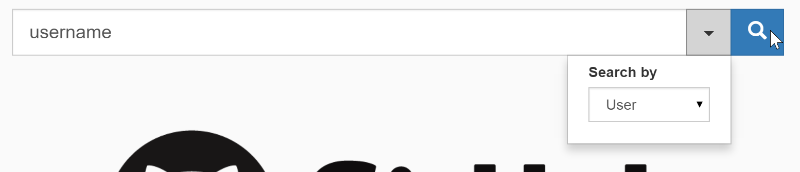
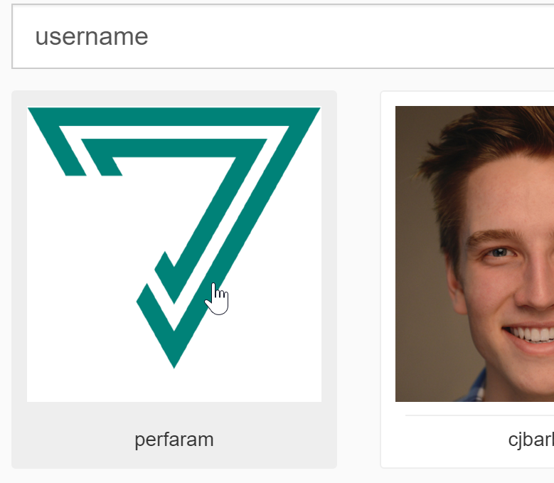
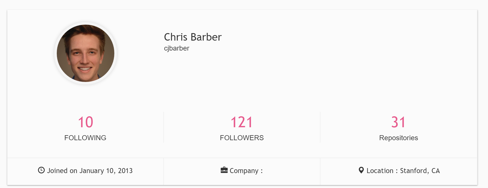
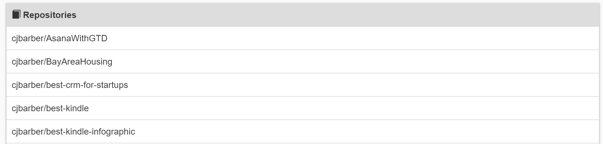
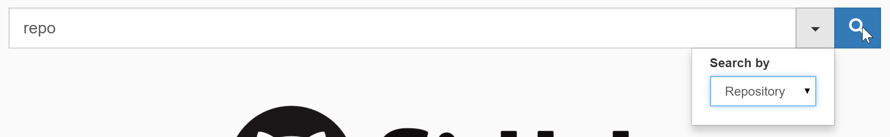
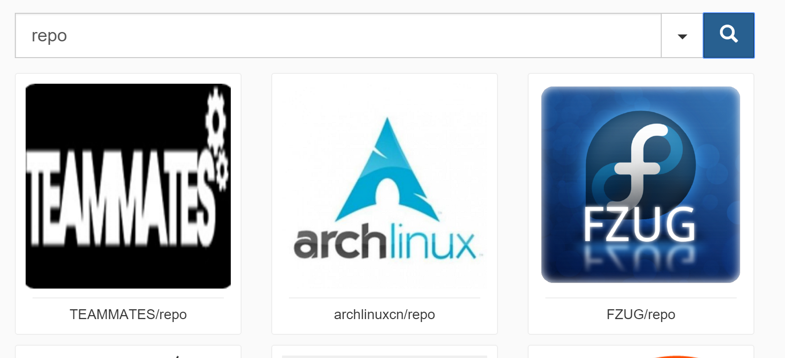
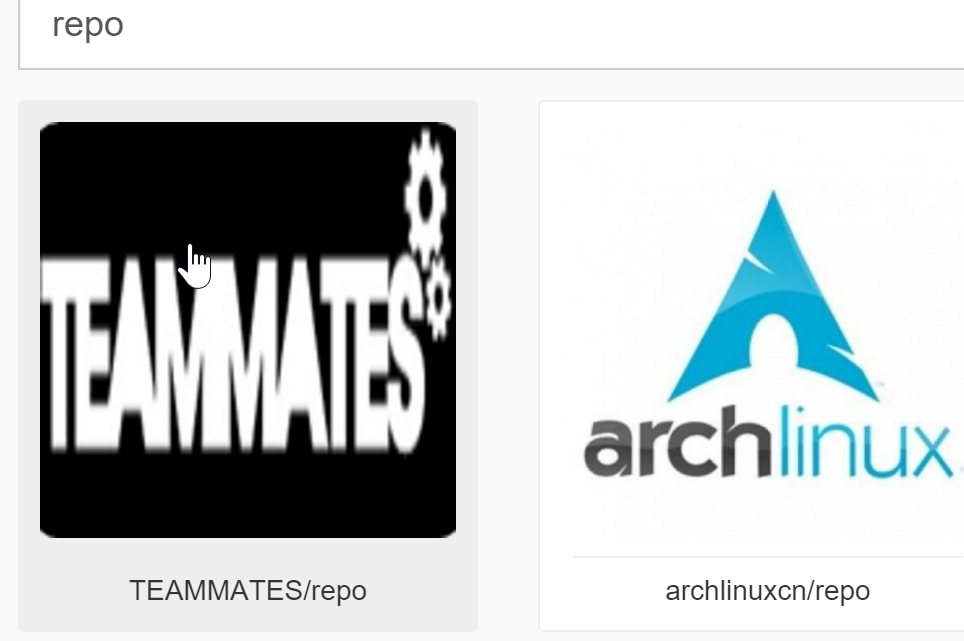
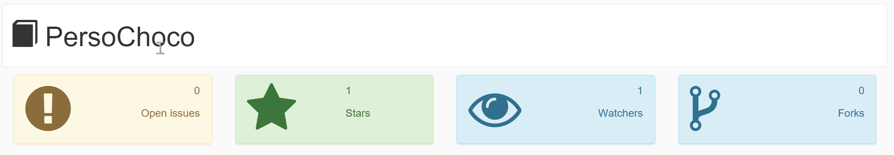
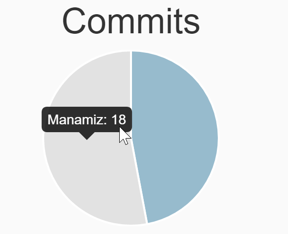
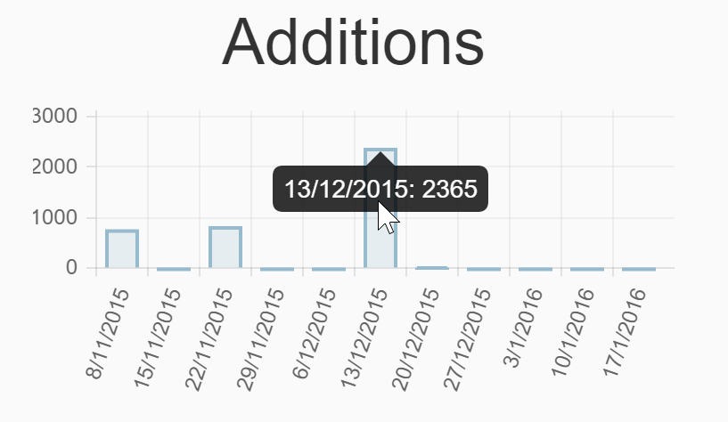

# gitmeter
## Table des matières
[TOC]

## Introduction

Lors de ce projet, j'ai choisi de développer une application AngularJS pour afficher du contenu obtenu via l'API GitHub pour ce projet, sujet numéro 2.

## Déploiement

Exécuter `npm install` et `bower install` pour installer les dépendances.
Exécuter `grunt serve` pour prévisualiser.

## Heroku

Vous trouverez une démo de [gitmeter](https://secure-taiga-70681.herokuapp.com) sur heroku.

## Objectifs
Lors de la création de cette application mes objectifs étaient les suivants :

 - Interface ergonomique
 - Interface responsive
 - Recherche d'utilisateurs et dépôts
 - Affichage des détails d'un utilisateur
 - Affichage de détails d'un dépôt
 - Statistiques d'un dépôt

## Technologies utilisées

 - HTML / CSS
 - JavaScript
 - AngularJS
 - Grunt / Npm / Bower

## API GitHub
Dans cette section, je vais vous parler des fonctionnalités fournies par l'API GitHub utilisées dans l'application gitmeter.
### Recherche
### Utilisateurs
####Récupérer 
### Dépôts

## Fonctionnalités de l'application 
Description des fonctionnalités fournies par l'application gitmeter.
### Utilisateurs
#### Recherche d'un utilisateur
L'application gitmeter permet de rechercher dans GitHub un utilisateur spécifique à l'aide d'une barre de recherche. Cette barre de recherche se trouve en haut de toutes les pages.

Les résultats s'affichent en dessous de la barre de recherche sous forme de petits cartes composées de l'avatar de l'utilisateur ainsi que de son identifiant.

Pour accéder aux détails d'un des utilisateurs il suffit de cliquer sur la carte correspondante.

#### Détails d'un utilisateur
La page affichant les détails d'un utilisateur se compose de deux parties différentes. La première partie se présente sous forme de carte pour afficher quelques informations relatives à l'utilisateur en question.

La deuxième parte est un simple tableau pour lister tous les dépôts auxquels l'utilisateur est lié.

### Dépôt
#### Recherche d'un dépôt
L'application gitmeter permet de rechercher dans GitHub un dépôt spécifique à l'aide d'une barre de recherche. Cette barre de recherche se trouve en haut de toutes les pages.

Les résultats seront affichés sous forme de petits cartes avec l'avatar du propriétaire du dépôts, l'identifiant du propriétaire et le nom du dépôt.

Pour accéder aux détails d'un des dépôts il suffit de cliquer sur la carte correspondante.

Comme nous pouvons le constater l'interface pour afficher les résultats est identique, que ce soit pour les utilisateurs ou pour les dépôts, cela a été 

#### Détails d'un dépôt
La page affichant les détails d'un dépôt se compose de deux parties différentes. La première partie se présente sous forme de petites cartes pour afficher quelques informations relatives au dépôt en question.

La deuxième parte est composé de graphiques pour présenter quelques statistiques relatives au dépôt.
##### Statistiques
Comme décrit au paragraphe précédent, la deuxième partie de la page est constitué de graphiques pour présenter les statistique du dépôt. 
Tout abord, un graphe camembert pour afficher le nombre de *commits* de chaque contributeur du dépôt. Ce type de graphe pour les *commits* est extrêmement utile car nous pouvons ressortir rapidement des informations comme qui est le contributeur le plus actif du dépôt.

Pour finir, un deuxième graphe, un graphe en barre, pour afficher le nombre d'ajouts et de suppressions dans le code. En utilisant un graphe en barre, nous pouvons constater quelles jours ont été le plus actifs et s'il y a plus d'ajouts que de suppressions un jour donné.

## Problèmes connus
### Chargement des graphiques
Lors du chargement d'une page avec les détails d'un dépôt, si l'API GitHub prends un moment à répondre les graphiques ne s'afficheront jamais. J'ai utilisé `$scope.apply()` à la fin de la récupération des données pour forcer l'affichage mais cela ne résout pas le problème.

### Bogge graphique
À l'affichage des données d'une recherche (utilisateurs / dépôts), si le texte dépasse une ligne l'affichage certains résultats de la ligne en dessous à sauter une ligne. Cela est dû au design responsive, il faudrait forcer tous les résultats d'une ligne à s'afficher à la même hauteur.

## Conclusion
Même si le développement WEB est un de mes domaines de prédilection je n'avais pas beaucoup utilisé AngularJS, n'ayant pas eu l'occasion de l'utiliser lors du projet de TWEB (partage du travail au sein du groupe). J'ai pu, grâce à ce projet, utiliser et approfondir mes connaissances de cette technologie WEB extrêmement intéressante.
Cela m'a aussi permis de mieux comprendre les outils comme grunt, bower et npm.